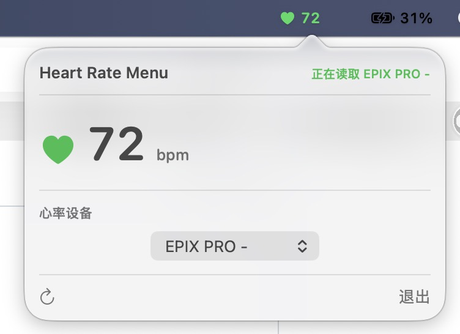

# Heart Rate Menu

一个小而专注的 macOS 菜单栏实时心率工具：适配支持心率广播的大部分佳明手表、外置心率带等产品，直接订阅设备投送的标准蓝牙心率，不依赖 Garmin Connect、云同步或 Android 手机。


## 适用设备

- **设备必须具备心率投送功能。** 本项目只支持标准 BLE Heart Rate Service `0x180D` 与 Heart Rate Measurement `0x2A37`。
- 面向支持心率广播的大部分佳明手表、外置心率带，以及兼容该标准的运动设备。Garmin 手表并非默认一定对 Mac 投送这个服务；请先到 Garmin 官网查询你的具体型号是否支持心率广播，以及需要在手表上开启哪一种广播模式。
- 不是所有型号、所有表盘状态或所有运动模式都支持。若设备未出现或连接后提示不支持，请先确认它当前正在广播心率。
- 本项目不读取 Garmin Connect，不使用厂商私有协议，也不会绕过蓝牙配对、设备限制或 macOS 权限。

## 功能

- 菜单栏显示实时心率
- 首次扫描后选择一次设备；仅在确认能订阅标准心率特征后才会保存绑定
- 保存设备的稳定蓝牙 UUID：下次启动、断开重扫或系统未直接恢复缓存时，发现同一设备便自动连接
- 可在面板中一键解除绑定，随后选择另一台设备
- 发现设备后再验证它是否提供标准心率服务，避免漏掉广告包未声明 `0x180D` 的兼容设备
- 无网络请求、无账号、无云同步、无健康数据上传

## 展示



上图是 Heart Rate Menu 的实际运行界面：菜单栏显示当前心率，面板显示连接状态、实时读数和已发现的设备。本项目只提供标准 BLE 实时心率。

## 安装与运行

### 直接下载（推荐）

在 [Releases](https://github.com/masha-97/heart-rate-menu/releases) 下载 `Heart-Rate-Menu-*-macos.zip`。解压后文件夹内附带《安装说明》，按说明将 `Heart Rate Menu.app` 移到“应用程序”文件夹。

发布包目前使用 ad-hoc 签名，尚未经过 Apple 公证。首次运行请在 Finder 中按住 Control 点击应用，选择“打开”并确认一次；之后可正常双击打开。若仍被拦截，可在“系统设置”->“隐私与安全性”中点击“仍要打开”。

### 从源码构建

需要 macOS 13 或更新版本，以及 Xcode Command Line Tools。

```sh
git clone https://github.com/masha-97/heart-rate-menu.git
cd heart-rate-menu
./scripts/build-app.sh
open "build/Heart Rate Menu.app"
```

维护者发布新版本时可运行 `./scripts/package-release.sh`，它会在 `dist/` 生成应用 ZIP 及对应的 SHA-256 校验文件。

首次运行时，请在系统提示中允许蓝牙访问。点击菜单栏心形图标，选择设备一次；以后应用会记住这台设备并自动重连。若要换设备，点击“心率设备”旁的解除绑定图标，再重新扫描选择。

## 开发与测试

```sh
./scripts/test.sh
swift build -c release
```

## 隐私

应用仅在本机通过蓝牙接收心率值，并在 `UserDefaults` 保存已验证设备的 UUID，用于后续自动重连。它不包含网络访问、分析 SDK、账号、Android 组件或厂商私有协议。

## 许可证

MIT License。详情见 [LICENSE](LICENSE)。

---

## English

Heart Rate Menu is a focused macOS menu-bar reader for most Garmin watches with heart-rate broadcasting, external heart-rate straps, and other devices that expose the standard BLE Heart Rate Service (`0x180D`) and Heart Rate Measurement characteristic (`0x2A37`). It reads direct BLE heart-rate notifications; it does not depend on Garmin Connect, cloud sync, or an Android phone.

Your device must actually support heart-rate broadcasting in its current mode. Check the manufacturer's official documentation for model support and how to enable broadcasting. This app uses only the standard BLE service and does not bypass pairing, vendor restrictions, or macOS Bluetooth permissions.

After a successful subscription, it remembers the device's CoreBluetooth UUID and reconnects when the same device is discovered again. You can explicitly unbind it from the popover before switching devices.

It has no account, cloud sync, network requests, analytics SDK, Android dependency, or vendor private protocol.
