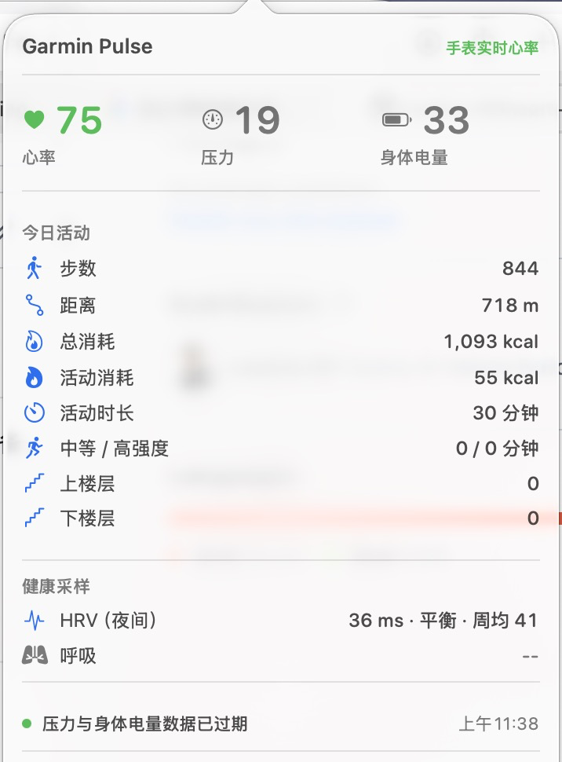

# Heart Rate Menu

macOS 菜单栏实时心率工具。它通过标准 Bluetooth Low Energy Heart Rate Service 读取你手动选择的设备，并在菜单栏显示当前心率。


## 使用前请确认

- 设备必须实际支持标准 BLE 心率投送功能，也就是 Heart Rate Service `0x180D` 与 Heart Rate Measurement `0x2A37`。
- 具体型号、表盘模式和是否需要手动开启心率广播，请查对应厂商官网。大多数运动手表和心率带具备这项功能，但并非所有设备或所有模式都会对 Mac 提供该服务。
- 本项目只读取标准心率服务；不会绕过设备配对、厂商限制或系统蓝牙权限。

## 功能

- 菜单栏显示实时心率
- 首次扫描后手动选择蓝牙设备
- 记住已验证设备，之后自动重连
- 连接后才验证设备是否提供标准心率服务
- 无网络请求、无账号、无云同步、无健康数据上传

## 展示



上图是作者自用的 Garmin Pulse 完整面板，用于展示菜单栏健康数据工具的呈现效果。该截图中的压力、身体电量、活动和健康采样均**不属于本开源项目**；本项目只提供标准 BLE 实时心率。

## 安装与运行

需要 macOS 13 或更新版本，以及 Xcode Command Line Tools。

```sh
git clone https://github.com/masha-97/heart-rate-menu.git
cd heart-rate-menu
./scripts/build-app.sh
open "build/Heart Rate Menu.app"
```

首次运行时，请在系统提示中允许蓝牙访问。点击菜单栏心形图标，选择设备；如果设备未出现，请确认它已开启心率投送后点击刷新。

## 开发与测试

```sh
./scripts/test.sh
swift build -c release
```

## 隐私

应用仅在本机通过蓝牙接收心率值，并在 `UserDefaults` 保存已验证设备的 UUID，用于后续自动重连。它不包含网络访问、分析 SDK、账号、Android 组件或厂商私有协议。

## 许可证

MIT License。详情见 [LICENSE](LICENSE)。

---

## English

Heart Rate Menu is a minimal macOS menu-bar app for devices that expose the standard BLE Heart Rate Service (`0x180D`) and Heart Rate Measurement characteristic (`0x2A37`).

Your device must actually support heart-rate broadcasting in its current mode. Check the manufacturer's official documentation for model support and how to enable broadcasting. This app uses only the standard BLE service and does not bypass pairing, vendor restrictions, or macOS Bluetooth permissions.

It has no account, cloud sync, network requests, analytics SDK, Android dependency, or vendor private protocol.
